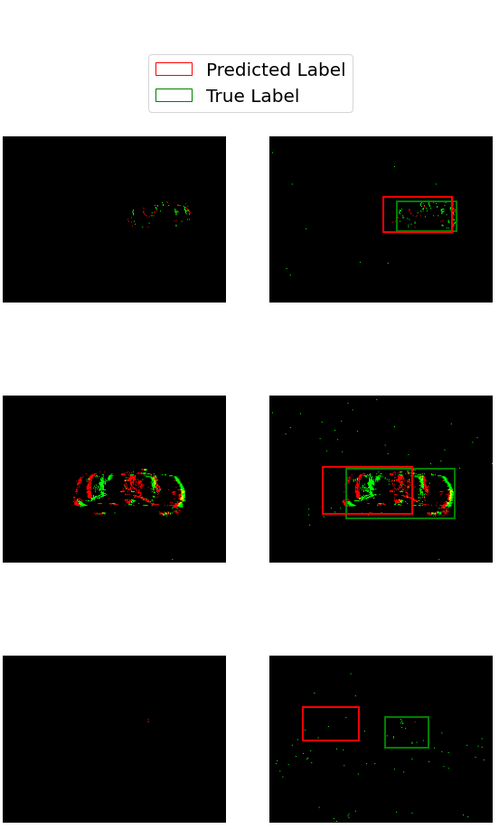
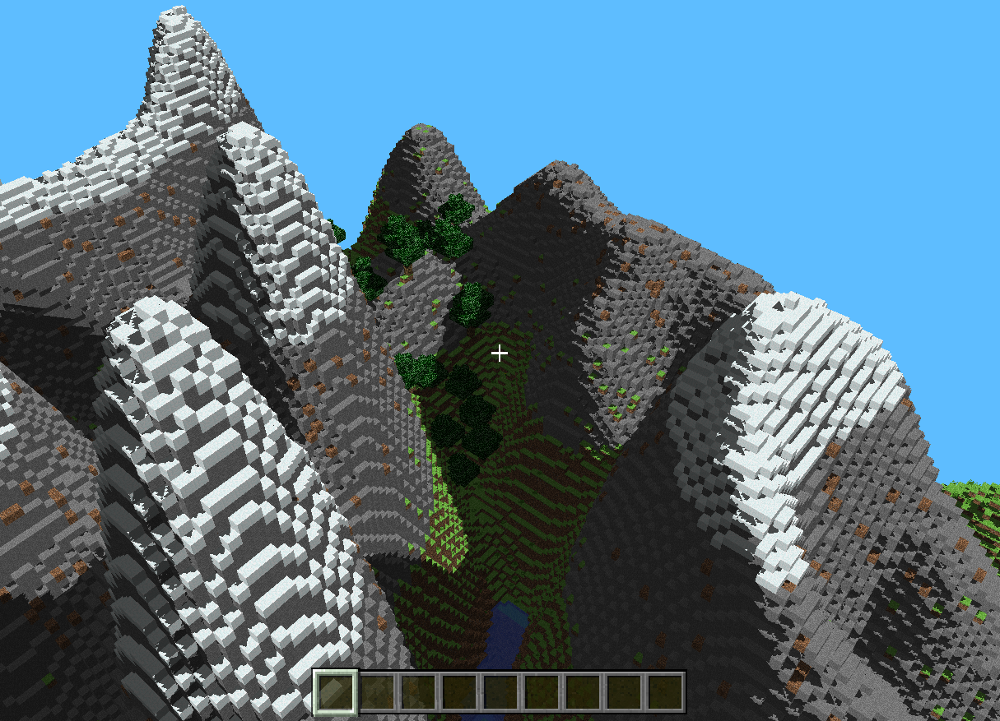
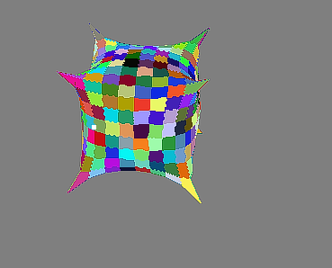
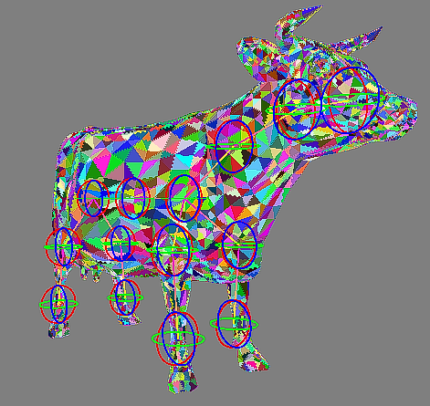
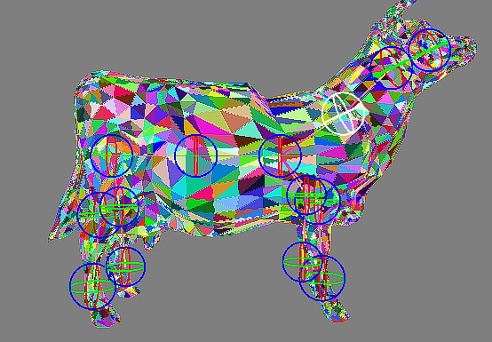
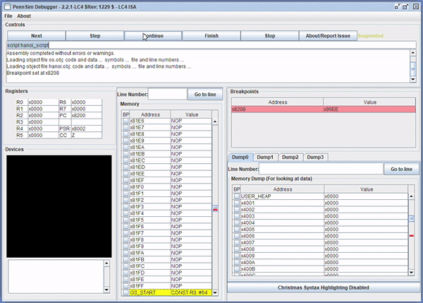
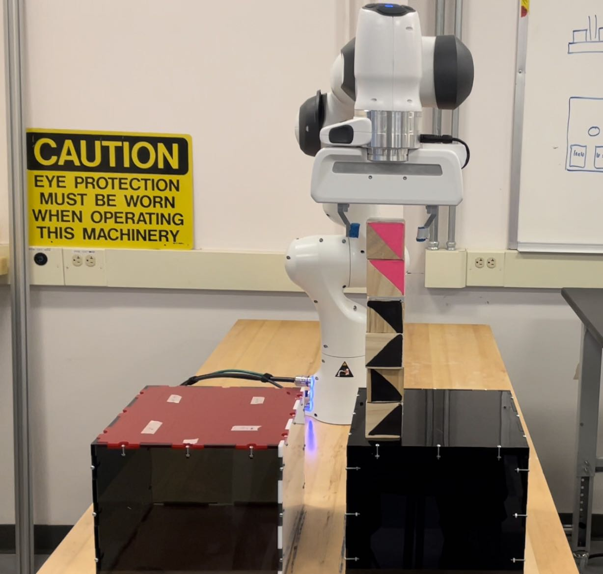
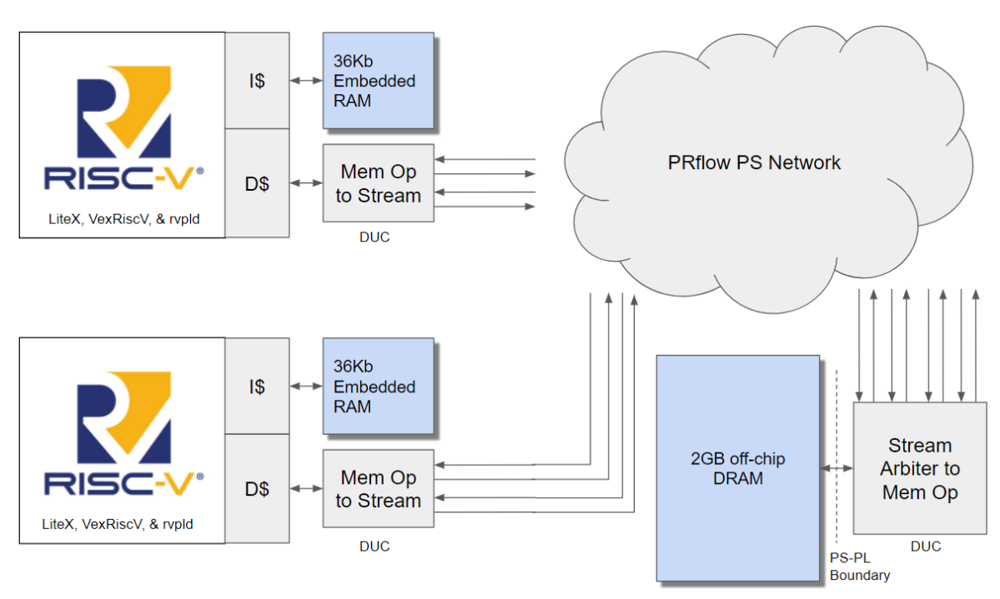
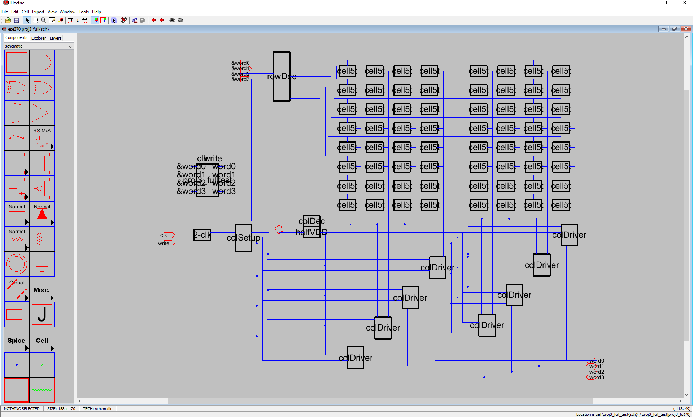
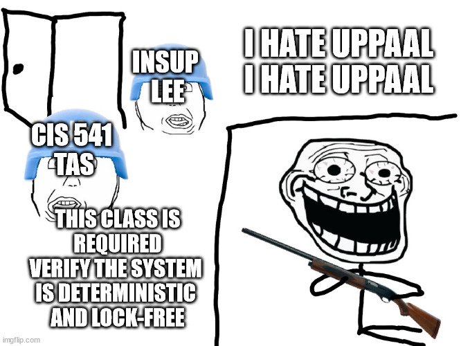

<!-- - 👋 Hi, I’m @LaurelinTheGold
- 👀 I’m interested in Computer Graphics, Computer Vision, and Computer Systems. 
- 🌱 I’m currently learning ...
- 💞️ I’m looking to collaborate on ...
- 📫 How to reach me ... -->

<!---
LaurelinTheGold/LaurelinTheGold is a ✨ special ✨ repository because its `README.md` (this file) appears on your GitHub profile.
You can click the Preview link to take a look at your changes.
--->

# Hello there #
<!--  -->

## About Me ##

I'm @LaurelinTheGold. I am currently a Masters Student at the University of Pennsylvania, where I am studying Robotics ('23). I also studied at Penn for undergrad, where I majored in Computer Engineering ('22).

I like code that: interacts with the real world[^1], uses cool math[^2] to solve problems[^3], runs fast in software[^4] or hardware[^5], and is correct[^6]

RISC-V Fan

[^1]: robotics, embedded systems

[^2]: Linear Algebra, Calculus, Complex Analysis, etc

[^3]: computer graphics, computer vision, deep learning, robotics

[^4]: Rust, C, C++, maybe even assembly

[^5]: GPUs, ~~FPGAs~~ jk, friendship ended with FPGAs. I would like to learn more about DSPs and OpenCL 

[^6]: 🥰 strong type systems my beloved 🥰, ❤️ Rust and Haskell ❤️

## Skills ##
### Programming Languages ###
`C++` `C` `Python` `Rust` `Haskell` `Objective-C` `Verilog`
### Graphics and GPU ###
`CUDA` `OpenGL` `Metal` `Vulkan` `cuDNN`
### Other ###
`LaTeX`

## Projects ##

### [cuFLAVR](https://github.com/adityahota/CIS565-Final-Project-SlowMo): ###
A Video Frame Interpolation Neural Network implemented using C++, CUDA, and cuDNN  
`C++` `CUDA` `cuDNN` `Python` `PyTorch`  
| **Original (30 FPS)** | **2x interpolated (30 FPS)** |
| --------------------- | ---------------------------- |
|  |  |

### [GPU Wavefront Pathtracer](https://github.com/LaurelinTheGold/Project3-CUDA-Path-Tracer): ###
Wavefront Path Tracer that also supports [A-trous Denoising](https://github.com/LaurelinTheGold/Project4-CUDA-Denoiser/tree/denoiser)  
`C++` `CUDA`  

### [Fill In The Gaps](): ###
Object Localization using Event Based Cameras  
`PyTorch` `Python` `Computer Vision` `U-Net` `Deep Learning`  

### [Vulkan Grass Renderer](https://github.com/LaurelinTheGold/Project5-Vulkan-Grass-Rendering): ### 
Physics-based grass simulation using tessellation shaders  
`C++` `Vulkan`  

### [CUDA Flocking Boids](https://github.com/LaurelinTheGold/Project1-CUDA-Flocking): ###
Flocking Boids  
`C++` `CUDA`  

### [Mini-Minecraft](): ###
Minecraft-like voxel sandbox game, [Demo](https://www.youtube.com/watch?v=d-_nEmR7Yp4)  
`C++` `OpenGL` `GLSL` `Qt Creator`  

### [MicroMaya Half Edge Mesh Editor](): ###
Half-Edge Mesh editor  
`C++` `OpenGL` `Qt Creator` `GLSL`  
| Catmull-Clark Subdivision | Skeleton/Joint Binding | Linear Blend Skinning |
|---------------------------|-------------------------------------|-----------------------|
|  |  |  |

### [JCompiler](): ###
A compiler for the J language[^JC] that targets LC4[^LC4] assembly  
`C`  
Towers of Hanoi demo, written in J, compiled to LC4, then run in a simulator  

### [CPU Pathtracer](https://github.com/LaurelinTheGold/RTIOW_rust): ###
CPU Pathtracer following the Ray Tracing in One Weekend [RTIOW](https://raytracing.github.io/books/RayTracingInOneWeekend.html) tutorial  
`Rust`  

### [Block Picking Competition](): ###
Franka Emika Panda Robot Arm Picking and Placing Blocks  
`ROS` `Python`  

### [Data Unlimited Compile for FPGAs](): ###
Easier FPGA prototyping with more RAM and faster compile times  
`FPGA` `RISC-V` `HLS C`  

## TODO ##
<!-- * [Rasterizer and Scene Graph?] -->

### [Superscalar Pipelined LC4 CPU](): ###
Dual-Issue, In-Order, Pipelined LC4[^LC4] CPU implemented in Verilog

### [PennOS](): ###
Unix-like OS with kernel and filesystem

### [PennShell](): ###
Shell with piping and builtins

### [Lu Syntax Checker]():  ###
Adding a type system, syntax checking, and language server to a subset of Lua using Haskell Monad Transformers

### [SRAM Design](): ###
16 Nibble SRAM and driver circuitry  
`GNU Electric` `Ngspice`  

### [Concurrent Event Timeline](): ###
Gantt chart generated from XML file

### [Gameul8](): ###
Chip8 Emulator built using C

<!-- ### Some Exposure ProgLangs###
`OCaml` `bash` `java` `Matlab/Simulink` `RISC-V`
### Some Exposure Other ###
`Control Theory` `Forward and Inverse Kinematics` `Networking` `Signal Processing`
### Operating Systems ###
`Linux` `MacOS` `Windows` -->

[^LC4]: RISC ISA designed for education based on Little Computer 3 (LC-3) from Patt and Patel

[^JC]: Stack-based language loosely based on Forth, not to be confused with [J Programming Language](https://en.wikipedia.org/wiki/J_(programming_language))

### [Traffic Manager](): ###
Schedule traffic at intersection  

